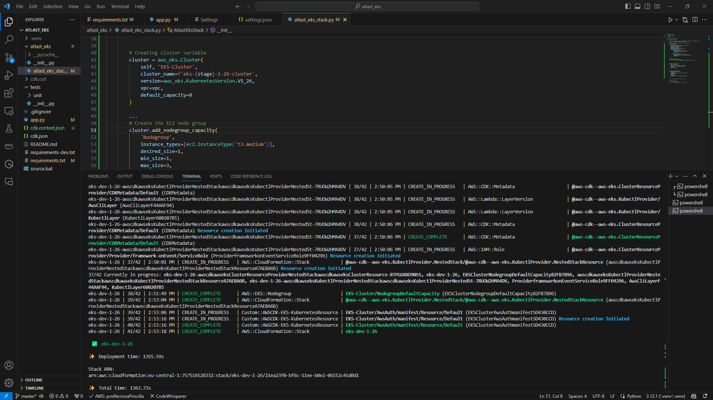

# Welcome to your CDK Python project!

This is a EKS Cluster project for CDK development with Python.

## Project requirements
**Prerequisites**

* AWS CLI
* Node.js
* Python
* IDE for programming language (VS Code)

## AWS CDK WORKFLOW
 
* Write a code in Python
* Which is routed to the CDK backend on NodeJS
* Generates CloudFormation Template and ChangeSets
* The CDK creates a bundle of Lambda functions for its work
* And only then resources are created

## Useful commands

 * `cdk ls`          list all stacks in the app
 * `cdk synth`       emits the synthesized CloudFormation template
 * `cdk deploy`      deploy this stack to your default AWS account/region
 * `cdk diff`        compare deployed stack with current state
 * `cdk docs`        open CDK documentation

To add additional dependencies, for example other CDK libraries, just add
them to your `setup.py` file and rerun the `pip install -r requirements.txt`
command.

Enjoy!

'''


The `cdk.json` file tells the CDK Toolkit how to execute your app.

This project is set up like a standard Python project.  The initialization
process also creates a virtualenv within this project, stored under the `.venv`
directory.  To create the virtualenv it assumes that there is a `python3`
(or `python` for Windows) executable in your path with access to the `venv`
package. If for any reason the automatic creation of the virtualenv fails,
you can create the virtualenv manually.

To manually create a virtualenv on MacOS and Linux:

```
$ python -m venv .venv
```

After the init process completes and the virtualenv is created, you can use the following
step to activate your virtualenv.

```
$ source .venv/bin/activate
```

If you are a Windows platform, you would activate the virtualenv like this:

```
% .venv\Scripts\activate.bat
```

**Install AWS CDK and Dependencies:**

*Install AWS CDK CLI Globally
```
% .npm install -g aws-cdk
```
 
 *Install AWS CDK using pip
```
% .pip install aws-cdk.core aws-cdk.aws-eks
```

Initialize a new AWS CDK project
```
%  .cdk int app --language python
```

After the above mentioned Installations a Folder would be created
```
.
├── README.md
├── app.py
├── atlast_eks
│   ├── __init__.py
│   └── atlast_eks_stack.py
├── cdk.json
├── requirements-dev.txt
├── requirements.txt
├── source.bat
└── tests
    ├── __init__.py
    └── unit
        ├── __init__.py
        └── test_atlast_eks_stack.py

4 directories, 11 files
```

Once the virtualenv is activated and the Python folder is created, you can install the required dependencies.

```
$ pip install -r requirements.txt
```

To Check that everything works:
```
$ cdk list
```
The Output should show you the Stack name example:
```
$ cdk list
AtlastEksStack
```
**We now have the following content of the app.py**


**In the atlast_eks/atlas_eks_stack.py we have a template to create a stack:**

```
$from aws_cdk import (
    # Duration,
    Stack,
    # aws_sqs as sqs,
)
from constructs import Construct

class AtlastEksStack(Stack):

    def __init__(self, scope: Construct, construct_id: str, **kwargs) -> None:
        super().__init__(scope, construct_id, **kwargs)

        # The code that defines your stack goes here

        # example resource
        # queue = sqs.Queue(
        #     self, "AtlastEksQueue",
        #     visibility_timeout=Duration.seconds(300),
        # )
```

**Now let's create VPC and Subnets**

Using the 

CDK VPC documentation – https://docs.aws.amazon.com/cdk/api/v2/python/aws_cdk.aws_ec2/Vpc.html.

Subnet docs – https://docs.aws.amazon.com/cdk/api/v2/python/aws_cdk.aws_ec2/SubnetType.html

Adding a dictionary availability_zones with zones and describe a subnet group, one Public and one Private, and CDK will create a subnet of each type in each Availability Zone.

https://docs.aws.amazon.com/cdk/api/v2/python/aws_cdk.aws_ec2/SubnetConfiguration.html

```
def __init__(self, scope: Construct, construct_id: str, **kwargs) -> None:
        super().__init__(scope, construct_id, **kwargs)

        availability_zones = ['us-east-1a', 'us-east-1b']

        # Create a new VPC
        vpc = ec2.Vpc(self, 'Vpc',
            ip_addresses=ec2.IpAddresses.cidr("10.0.0.0/16"),
            vpc_name='eks-vpc',
            enable_dns_hostnames=True,
            enable_dns_support=True,
            availability_zones=availability_zones,
            subnet_configuration=[
                ec2.SubnetConfiguration(
                    name='eks-subnet-public',
                    subnet_type=ec2.SubnetType.PUBLIC,
                    cidr_mask=24
                ),
                ec2.SubnetConfiguration(
                    name='eks-subnet-private',
                    subnet_type=ec2.SubnetType.PRIVATE_WITH_EGRESS,
                    cidr_mask=24
                )
          ]
```
**IAM Role and aws-auth ConfigMap**

The next thing to do is to create an IAM role that can be assumed to gain access to the cluster.

So far, without any RBAC and user groups – just a role to be executed later aws eks update-kubeconfig.

Use the aws_cdk.aws_iam.Role() and aws_cdk.aws_eks.AwsAuth():
```
from aws_cdk import (
    ...
    aws_iam as iam,
    ...
)
...
        # Create an IAM Role to be assumed by admins
        masters_role = iam.Role(
            self,
            'EksMastersRole',
            assumed_by=iam.AccountRootPrincipal()
        )

        # Attach an IAM Policy to that Role so users can access the Cluster
        masters_role_policy = iam.PolicyStatement(
            actions=['eks:DescribeCluster'],
            resources=['*'],  # Adjust the resource ARN if needed
        )
        masters_role.add_to_policy(masters_role_policy)

        cluster.aws_auth.add_masters_role(masters_role)

        # Add the user to the cluster's admins
        admin_user = iam.User.from_user_arn(self, "AdminUser", user_arn="arn:aws:iam::492***148:user/arseny")
        cluster.aws_auth.add_user_mapping(admin_user, groups=["system:masters"])
```

The masters_role is a role that can be assumed by anyone from an AWS account, and admin_user is my personal IAM user for direct access to the cluster.


**CfnOutput**
Outputs of the CloudFormation stack. As far as I remember, it can be used for cross-stack use of values, but we need it to get the ARN of the masters_role:
```
from aws_cdk import (
    ...
    Stack, CfnOutput
)
...
        # Output the EKS cluster name
        CfnOutput(
            self,
            'ClusterNameOutput',
            value=cluster.cluster_name,
        )

        # Output the EKS master role ARN
        CfnOutput(
            self,
            'ClusterMasterRoleOutput',
            value=masters_role.role_arn
        )
```

**Creating an EKS cluster**

Update the atlast_eks_stack.py file set the version as:
```
version=eks.KubernetesVersion.V1_28
```

Add the vpc parameter to the eks.Cluster(). Hence EKS cluster code block would be:
```
 cluster = eks.Cluster(
            self, 'EKS-Cluster',
            cluster_name='eks-cluster',
            version=eks.KubernetesVersion.V1_28,
            vpc=vpc
            default_capacity=0
        )
```

*At this point you can now synthesize the CloudFormation template for this code.*

```
$ cdk synth
```
Cloudformation template would look something like this example:

```
$ cdk synth

    Type: Custom::AWSCDK-EKS-Cluster
    Properties:
      ServiceToken:
        Fn::GetAtt:
          - awscdkawseksClusterResourceProviderNestedStackawscdkawseksClusterResourceProviderNestedStackResource9827C454
          - Outputs.AtlastEksStackawscdkawseksClusterResourceProviderframeworkonEvent588F9666Arn
      Config:
        name: eks-cluster
...
```
*Now all you got to do is deploy your Stack which has the code for VPC and EKS Cluster*
```
$ cdk deploy
```


Now let's check the AWS Console for the creation of Cloudformationstack, EKS cluster and VPC and its components.

The Cloudformation Stack


EKS Cluster creation


Cluster IAM role ARN


Cluster Network


Cluster VPC Map


**Now that we created a simple EKS cluster Let's create update the code by adding a NodeGroup**

Managed NodeGroup using: https://docs.aws.amazon.com/cdk/api/v1/python/aws_cdk.aws_eks/README.html#managed-node-groups

**Managed node groups**
Amazon EKS managed node groups automate the provisioning and lifecycle management of nodes (Amazon EC2 instances) for Amazon EKS Kubernetes clusters. With Amazon EKS managed node groups, you don’t need to separately provision or register the Amazon EC2 instances that provide compute capacity to run your Kubernetes applications. You can create, update, or terminate nodes for your cluster with a single operation.
```
   nodegroup = cluster.add_nodegroup_capacity(
             'Nodegroup',
             instance_types=[ec2.InstanceType('t3.medium')],
             desired_size=1,
             min_size=1,
             max_size=3,
            ami_type=aws_eks.NodegroupAmiType.AL2_X86_64
  )
``` 
**Now to Deploy an Application inside Nodegroup**

We are using the *Helm* is a package manager for Kubernetes applications, allowing us to define, install, and upgrade even the most complex Kubernetes applications.
* Helm charts provide a convenient way to package, version, and distribute applications and services in a Kubernetes-native way.
* By using a Helm chart, you can simplify the deployment of complex applications like WordPress. The Helm chart encapsulates the necessary configurations, dependencies, and resources needed for the WordPress application.

Helmchart Documentation: https://docs.aws.amazon.com/cdk/api/v2/python/aws_cdk.aws_eks/HelmChart.html

```
# Helm chart for WordPress
        aws_eks.wordpress_chart = aws_eks.HelmChart(
            self, 'WordPressChart',
            chart='wordpress',
            release='wordpress',
            repository='https://charts.bitnami.com/bitnami',
            namespace='default',
            values={
                'mariadb.enabled': False,
                'externalDatabase.host': 'Your RDS Endpoint',  # RDS endpoint
                'externalDatabase.user': 'Your username',   # RDS username
                'externalDatabase.password': 'Your Password', # RDS password
            }
        )
``` 


After all the required changes and updates made in the code you can deploy your stack again for it to be reflected in the already created stack in Cloudformation in your console. 

```
$ cdk deploy
```


**Fingers crossed it should get deployed! :)**

After successfull deployment we **Configuring kubectl with AWS CLI**

Configuring kubectl with the AWS CLI after deploying an Amazon EKS (Elastic Kubernetes Service) cluster is a crucial step to establish a connection between your local development environment and the EKS cluster.

Install Kubctl : https://docs.aws.amazon.com/eks/latest/userguide/install-kubectl.html
.
.
Install AWS CLI : https://docs.aws.amazon.com/powershell/latest/userguide/pstools-getting-set-up-windows.html

Then Update the .aws\config file: with IAM Role EKSMasterRole as the admin for EKS cluster

```
[profile work]
region = us-east-1
output = json

[profile work-eks]
role_arn = arn:aws:iam::757******332:role/eks-dev-1-26-EksMastersRoleD1AE213C-1ANPWK8HZM1W5
source_profile = work
```
Create kube-config:

```
$ aws --profile work-eks eks update-kubeconfig --region eu-central-1 --name eks-dev-1-26-cluster
pdated context arn:aws:eks:eu-central-1:757516528332:cluster/eks-dev-1-26-cluster in C:\Users\mjona\.kube\config
```

And then to Check access:

```
$ kubectl get node
```


